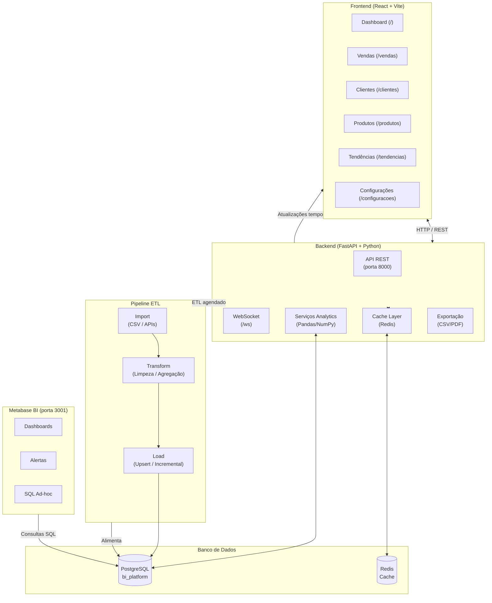
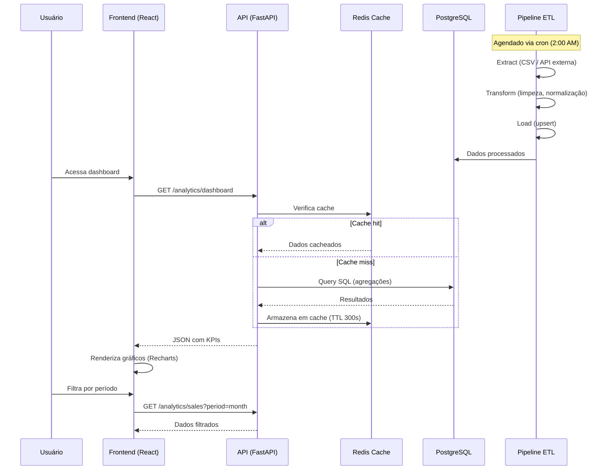
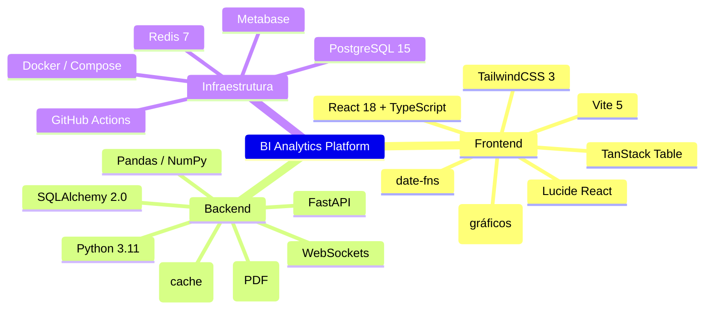
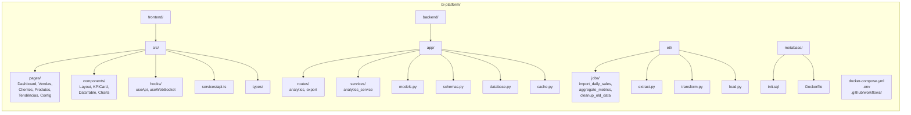
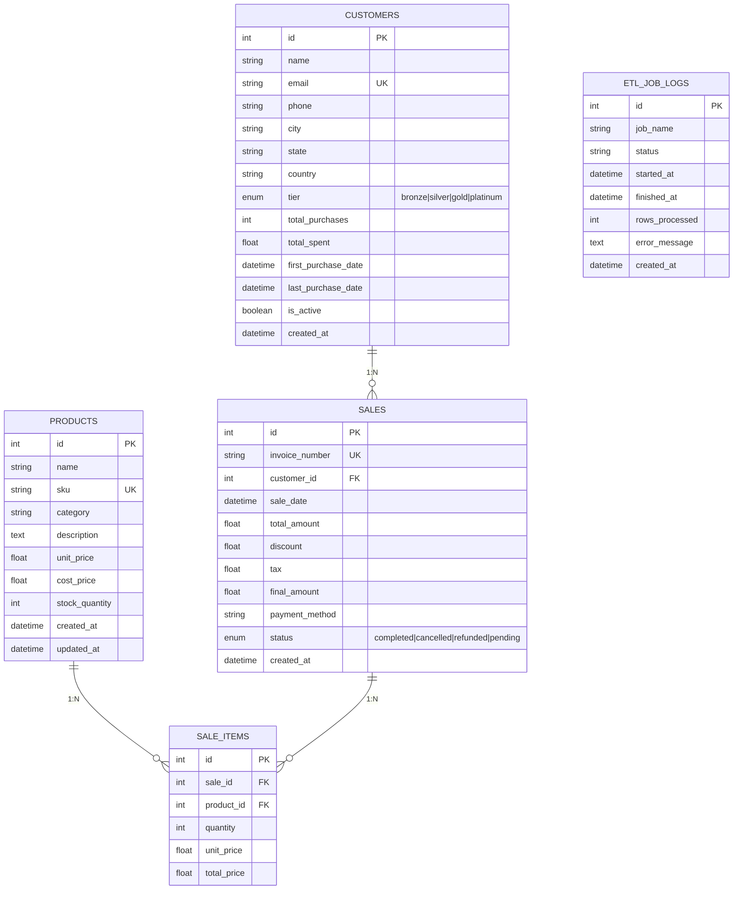

<p align="center">
  
  
  
  
  
  
  
  
</p>

# BI Analytics Platform

Plataforma completa de **Business Intelligence e Analytics** com frontend React, backend FastAPI, pipeline ETL automatizado e Metabase integrado — tudo orquestrado com Docker.

## 📋 Sumário

- [Arquitetura](#arquitetura)
- [Fluxo de Dados](#fluxo-de-dados)
- [Tecnologias](#tecnologias)
- [Funcionalidades](#funcionalidades)
- [Quick Start](#quick-start)
- [Estrutura do Projeto](#estrutura-do-projeto)
- [Modelo de Dados](#modelo-de-dados)
- [Endpoints da API](#endpoints-da-api)
- [Desenvolvimento Local](#desenvolvimento-local)
- [Metabase](#metabase)
- [CI/CD](#cicd)
- [Contribuindo](#contribuindo)
- [Licença](#licença)

---

## Arquitetura



## Fluxo de Dados



## Tecnologias



## Funcionalidades

| Funcionalidade | Descrição |
|---|---|
| **Dashboard** | 5 KPIs (Receita, Pedidos, Clientes Ativos, Ticket Médio, Conversão) com indicador de crescimento |
| **Relatório de Vendas** | Vendas por dia, categoria, método de pagamento, top produtos |
| **Relatório de Clientes** | Distribuição por tier, região, top clientes, taxa de retenção |
| **Relatório de Produtos** | Top vendidos, estoque baixo, distribuição por categoria |
| **Análise de Tendências** | Sazonalidade, previsão de receita, crescimento de clientes |
| **Exportação** | CSV e PDF de qualquer relatório |
| **Filtro por Período** | Hoje, 7 dias, mês, ano ou personalizado |
| **Modo Escuro** | Alterna entre claro/escuro |
| **SQL Customizado** | Consulta SQL livre na página de configurações |
| **WebSocket** | Atualizações em tempo real |
| **Metabase** | BI avançado com dashboards, alertas e análises ad-hoc |
| **ETL Automatizado** | Pipeline agendado via GitHub Actions |

## Quick Start

### Pré-requisitos

- [Docker](https://docs.docker.com/get-docker/) e [Docker Compose](https://docs.docker.com/compose/install/)
- Node.js 20+ (para desenvolvimento local do frontend)
- Python 3.11+ (para desenvolvimento local do backend)

### Executando com Docker

```bash
docker compose up -d
```

Isso inicia todos os serviços: PostgreSQL, Redis, Backend, Frontend e Metabase.

**Acessar:**

| Serviço | URL |
|---|---|
| Frontend | http://localhost:5173 |
| Backend API | http://localhost:8000/docs |
| Metabase | http://localhost:3001 |

### Populando o Banco com Dados de Exemplo

Após iniciar os containers, execute o seed para gerar 90 dias de dados fictícios:

```bash
docker exec bi-backend python seed.py
```

> O seed cria 12 produtos, 12 clientes e ~700 vendas com pagamentos, descontos e status variados.

## Estrutura do Projeto



```
bi-platform/
├── frontend/                  # React + Vite + TypeScript
│   ├── src/
│   │   ├── pages/             # Dashboard, Vendas, Clientes, Produtos, Tendências, Config
│   │   ├── components/        # Layout, KPICard, DataTable, Charts (Line, Bar, Pie)
│   │   ├── hooks/             # useApi, useWebSocket, useDarkMode
│   │   ├── services/          # api.ts (axios, timeout 30s)
│   │   ├── types/             # Interfaces TypeScript
│   │   └── utils/             # date.ts, format.ts (locale pt-BR)
│   ├── Dockerfile
│   └── package.json
│
├── backend/                   # Python FastAPI
│   ├── app/
│   │   ├── routes/            # analytics.py, export.py
│   │   ├── services/          # analytics_service.py (consultas SQL + Pandas)
│   │   ├── models.py          # Product, Customer, Sale, SaleItem, ETLJobLog
│   │   ├── schemas.py         # Pydantic (DashboardKPI, SalesReport, ...)
│   │   ├── database.py        # SQLAlchemy engine, init_db()
│   │   ├── cache.py           # Redis cache (async)
│   │   ├── config.py          # Config (variáveis de ambiente)
│   │   └── main.py            # FastAPI app com lifespan
│   ├── seed.py                # Dados de exemplo
│   ├── tests/
│   ├── requirements.txt
│   └── Dockerfile
│
├── etl/                       # Pipeline ETL standalone
│   ├── jobs/
│   │   ├── import_daily_sales.py   # Importa CSV (ou gera dados de exemplo)
│   │   ├── aggregate_metrics.py     # Agrega métricas diárias
│   │   └── cleanup_old_data.py      # Limpa dados antigos
│   ├── extract.py             # Extractor (CSV, JSON, Excel, API REST)
│   ├── transform.py           # Transformer (limpeza, normalização)
│   ├── load.py                # Loader (upsert, incremental)
│   ├── runner.py              # CLI: once | schedule | import | aggregate | cleanup
│   ├── database.py
│   └── config.py
│
├── metabase/                  # Configuração Metabase
│   ├── Dockerfile
│   └── init.sql
│
├── .github/workflows/         # GitHub Actions (CI/CD + ETL agendado)
└── docker-compose.yml         # Orquestração
```

## Modelo de Dados



## Endpoints da API

### Analytics

| Método | Rota | Descrição | Parâmetros |
|---|---|---|---|
| GET | `/analytics/dashboard` | KPIs (receita, pedidos, ticket médio, conversão) | `start_date`, `end_date` |
| GET | `/analytics/sales` | Relatório completo de vendas | `start_date`, `end_date`, `period` |
| GET | `/analytics/customers` | Relatório de clientes | `start_date`, `end_date` |
| GET | `/analytics/products` | Relatório de produtos | `start_date`, `end_date` |
| GET | `/analytics/trends` | Tendências e sazonalidade | `months` (3-36) |
| POST | `/analytics/custom-query` | SQL personalizado | `query`, `params` |
| POST | `/analytics/cache/invalidate` | Limpa cache | `pattern` |

### Exportação

| Método | Rota | Descrição |
|---|---|---|
| GET | `/export/csv` | Exportar CSV |
| GET | `/export/pdf` | Exportar PDF |

### WebSocket

| Rota | Descrição |
|---|---|
| `/ws` | Atualizações em tempo real (cache invalidado) |

## Desenvolvimento Local

### Backend

```bash
cd backend
python -m venv venv
# Windows:
.\venv\Scripts\activate
# Linux/Mac:
# source venv/bin/activate
pip install -r requirements.txt
uvicorn app.main:app --reload
```

### Frontend

```bash
cd frontend
npm install
npm run dev
```

### ETL Pipeline

```bash
cd etl
pip install -r requirements.txt
python runner.py once       # Executa todos os jobs uma vez
python runner.py import     # Só o job de importação
python runner.py aggregate  # Só agregação
python runner.py schedule   # Modo agendado (cron)
```

## Metabase

### Setup Inicial

1. Acesse http://localhost:3001
2. Crie uma conta de administrador
3. Conecte ao banco de dados com as credenciais:

| Campo | Valor |
|---|---|
| Tipo | PostgreSQL |
| Host | `postgres` |
| Porta | `5432` |
| Database | `bi_platform` |
| Usuário | `postgres` |
| Senha | `postgres` |

### Dashboards Sugeridos

- **Visão Geral de Vendas** — Receita, pedidos, ticket médio
- **Análise de Clientes** — Distribuição por tier e região
- **Performance de Produtos** — Top produtos e categorias
- **Sazonalidade** — Vendas por dia da semana/mês

### Alertas

Configure alertas no Metabase para monitorar:
- Queda abrupta de vendas (>20% vs dia anterior)
- Estoque baixo (< 5 unidades)
- Pico de cancelamentos (>10% no dia)

## CI/CD

O projeto utiliza **GitHub Actions** para:

| Workflow | Descrição |
|---|---|
| `python-tests.yml` | Executa testes automatizados do backend a cada push |
| `etl-pipeline.yml` | Pipeline ETL agendado (2:00 AM UTC) |
| `deploy.yml` | Deploy automatizado (quando configurado) |

## Contribuindo

Contribuições são bem-vindas! Siga os passos abaixo:

1. **Fork** o projeto
2. **Crie uma branch** para sua feature: `git checkout -b feature/nova-feature`
3. **Commit** suas mudanças: `git commit -m 'feat: adiciona nova feature'`
4. **Push** para a branch: `git push origin feature/nova-feature`
5. Abra um **Pull Request**

### Padrões de Commit

- `feat:` — nova funcionalidade
- `fix:` — correção de bug
- `docs:` — documentação
- `refactor:` — refatoração
- `test:` — testes
- `chore:` — tarefas de manutenção

## Licença

Distribuído sob a licença MIT. Veja o arquivo [LICENSE](LICENSE) para mais informações.
